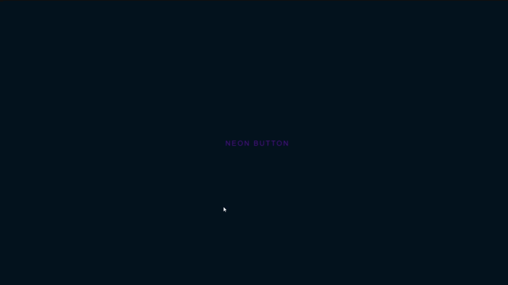

## Welcome to some fine looking template (my opinion)

### In this repository you will be able to see 📺

* 📋 Simple source code in type of html, css or javascript
* 📲 Some picture for making the page better
* 💡 Even implement some outsider frameworks

### Page Preview 📷

* Simple Login Form

* Neon Button (From: [Online Tutorials](https://www.youtube.com/channel/UCbwXnUipZsLfUckBPsC7Jog))

* Password validator (From: [codeSTACKr](https://github.com/codeSTACKr))

* Resizeable background when scroll down (From: [Online Tutorials](https://www.youtube.com/channel/UCbwXnUipZsLfUckBPsC7Jog))

* Custom 404 Page (From: [Online Tutorials](https://www.youtube.com/channel/UCbwXnUipZsLfUckBPsC7Jog))

### Connect with me 👐

[][website]
[][facebook]
[][youtube]
[][twitter]
[][gmail]
[][steam]

 
 

As I always said:
> You live,
> you burn

#### © 2020 by Hantomi

[website]: https://github.com/hantomi
[twitter]: https://twitter.com/HantoLong
[youtube]: https://www.youtube.com/channel/UCadVLV4Icg1dWZBTPnYed4Q
[facebook]: https://www.facebook.com/long.hanto
[gmail]: mailto:redragon12371@gmail.com
[steam]: https://steamcommunity.com/id/hantomi2690/